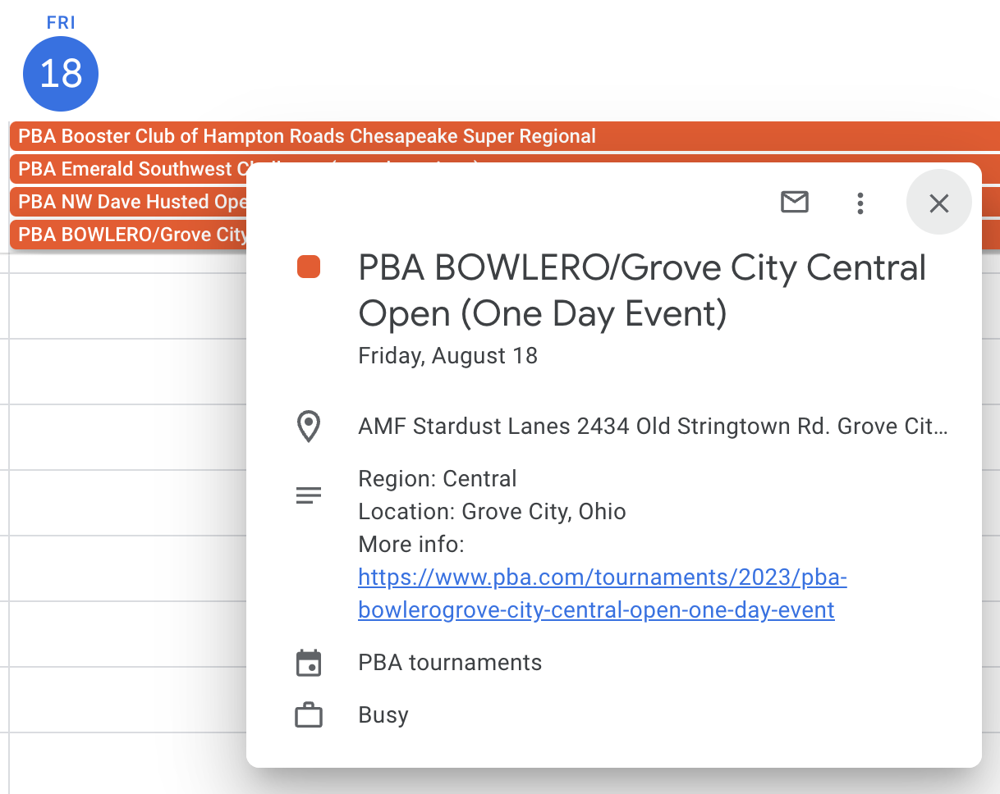
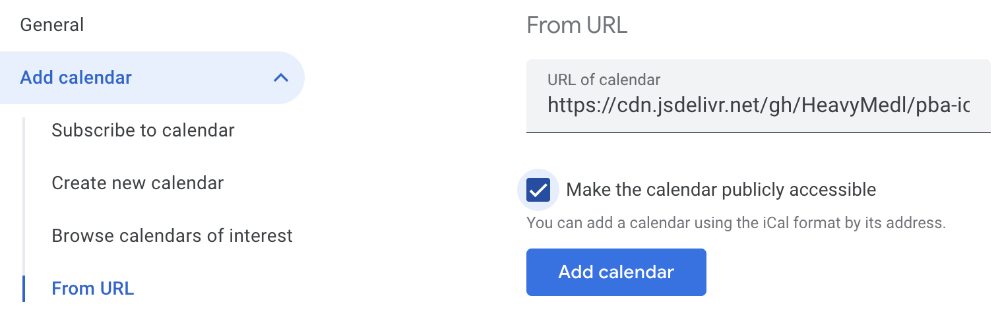

# pba-ical

This program scrapes all of the [listed PBA tournaments](https://www.pba.com/tournament-schedule) to create a generic model, outputted as `data/pba-tournaments.json`, which is then used to generate an iCalendar (`pba-tournaments.ics`) reflecting PBA tournaments.



## Usage

### Adding the calendar

Navigate to your calendar settings and add a calendar "from URL". I recommend adding the calendar this way instead of importing all of the individual events from the `pba-tournaments.ics` as it's more flexible to unsubscribe and toggle on and off.



I'm using `jsdelivr` as a CDN for the ICS file which allows me to version each "release".

Use the latest release's semver:

https://cdn.jsdelivr.net/gh/HeavyMedl/pba-ical@2.0.0/pba-tournaments.ics

Feel free to fork this repo and host your own!

### Running the scraper and ICS generator

Clone the repository

```sh
$ git clone https://github.com/HeavyMedl/pba-ical.git && cd pba-ical/
$ npm ci
$ npm run execute:all
```
